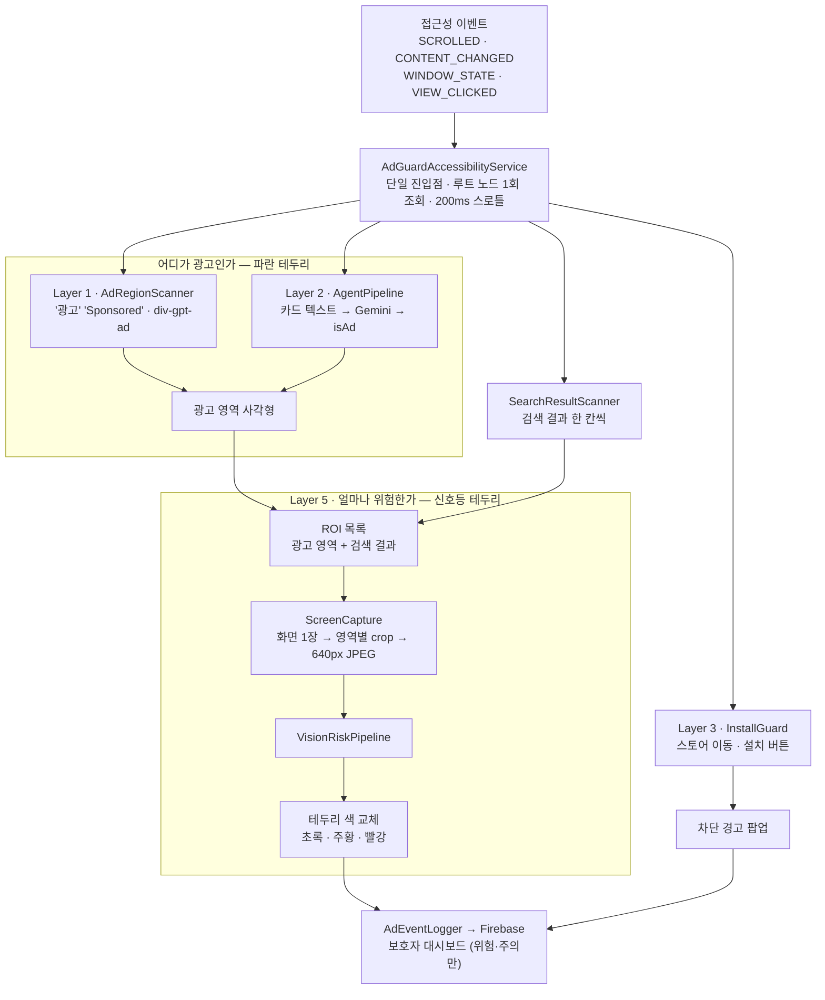
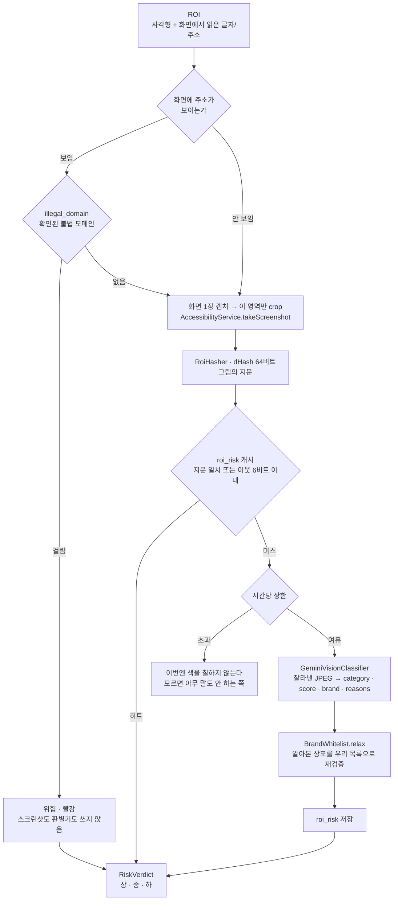

# SeniorAdGuard

어르신 스마트폰의 광고를 찾아내고, **그 광고가 얼마나 위험한지를 테두리 색으로** 알려주는 안드로이드 앱입니다.

```
초록 = 안전해요      주황 = 주의하세요      빨강 = 위험해요
```

---

## 어떻게 동작하나요?

| 단계 | 방법 | 결과 |
|------|------|------|
| 1단계 | 광고 키워드/패턴 즉시 감지 | 파란 테두리 "광고" |
| 2단계 | AI가 애매한 광고를 맥락으로 판별 | 파란 점선 "광고 같아요" |
| 3단계 | 의심스러운 앱 설치 차단 | 설치 전 경고 |
| **5단계** | **그 영역을 잘라 이미지로 위험도 판별** | **초록 / 주황 / 빨강 테두리** |

1·2단계가 **어디가 광고인지**를 찾고, 5단계가 그 사각형을 그대로 잘라 **얼마나 위험한지**를 봅니다.
앞의 둘이 만든 영역이 뒤의 입력이 되는 구조입니다.

색은 두 벌로 나뉩니다. **파랑 계열은 "광고다"(아직 위험도를 모름)**, **신호등은 "위험도가 이만큼"**입니다.
판별이 끝나면 파란 테두리가 신호등 색으로 **바뀝니다**.

---

## 왜 이미지인가 — 실측이 방향을 정했습니다

이전 버전은 광고가 연결하는 **URL**로 위험도를 판별했습니다. 실기기에서 재보니 이렇게 나왔습니다.

| 환경 | 광고 표시 | URL 확보 |
|------|----------|---------|
| 크롬 (모바일 웹) | 정상 | 첫 홉만 (`ad.doubleclick.net`) |
| **유튜브** | **19회** | **0건** |
| 딥링크 광고 (쿠팡) | 정상 | 0건 — URL 자체가 없음 |

유튜브에서 광고를 19번 표시하는 동안 판별할 URL은 하나도 없었습니다.
네이티브 앱 광고를 **누르기 전에** 판단할 수단은 화면 픽셀뿐입니다.

URL 경로(`com.senioradguard.url`)는 코드로 남아 있고, Layer 5가 불법 도메인 조회에 계속 씁니다.
다만 **화면에 뜨던 전체 화면 경고는 걷어냈습니다** — 검색 결과를 보다가 그 경고가 떠서
Layer 5가 그린 테두리를 통째로 덮는 것을 실기기에서 확인했습니다. 판정을 알리는 언어는 하나여야 합니다.

---

## 전체 아키텍처



---

## Layer 5 — ROI 이미지 판별

### 판정 순서

앞 단계일수록 쌉니다. 스크린샷을 찍고 판별기를 부르는 것은 **처음 보는 그림**일 때뿐입니다.



### 등급 기준

| 등급 | 색 | 무엇이 여기 오는가 |
|------|-----|------------------|
| **하** | 초록 | 알려진 기업·기관의 정상 광고, 공식 OTT·언론사, 효과를 부풀리지 않는 평범한 광고 |
| **중** | 주황 | **과장 광고**("운동 없이 한 달 10kg", "먹기만 하면 무릎 통증 끝"), 광고주를 알 수 없는 건강식품·투자 권유, 개인정보를 요구하는 경품 |
| **상** | 빨강 | 성인·선정적 내용, 도박·토토·카지노, 불법 다시보기, 브랜드·공공기관 사칭, APK 직접 배포 |

프롬프트에 비대칭 규칙을 넣었습니다.

- 알려진 기업의 정상 광고에 경고를 띄우면 **사용자가 경고 자체를 무시하게 되어 놓친 위험보다 해롭습니다** → 확신이 없으면 낮은 쪽
- 다만 성인·도박·불법 콘텐츠는 **확신이 없어도 '상'** → 놓쳤을 때의 피해가 오탐보다 훨씬 큽니다

### 상표 화이트리스트 — 만능 면죄부가 아닙니다

판별기가 그림에서 상표를 읽어냅니다("삼성", "SAMSUNG", 로고만 있어도). 그 이름이
[BrandWhitelist]의 목록에 있으면 위험도를 '안전'으로 낮춥니다.

**단, 사칭은 정확히 그 이름을 씁니다.** 그래서 성격이 사칭·불법·도박·성인·악성앱·과장이면
상표를 알아봤더라도 낮추지 않습니다. 상표를 알아봤다는 사실이 오히려 사칭의 근거일 수 있습니다.

```
"쿠팡" + UNVERIFIED_THIRD_PARTY(55점)  →  안전 20점 (초록)
"네이버" + PHISHING_OR_SCAM(90점)      →  위험 90점 (빨강)  ← 낮추지 않는다
"쿠팡" + EXAGGERATED_CLAIM(55점)       →  주의 55점 (주황)  ← 알려진 회사도 과장은 한다
```

### 캐시 키가 왜 픽셀 지문인가

좌표는 쓸 수 없습니다 — 같은 배너가 스크롤할 때마다 다른 자리에 있습니다.
텍스트도 쓸 수 없습니다 — **글자 없는 이미지 배너에는 키가 아예 없고, 그게 이 레이어를 만든 이유입니다.**

남는 것은 그림 자체의 지문입니다. 9×8 회색조에서 **이웃 픽셀끼리의 대소**만 보는 dHash를 씁니다.
평균값 기준(aHash)은 밝기가 조금만 흔들려도 비트가 뒤집히는데, 광고는 애니메이션으로
계속 밝아졌다 어두워집니다. 64비트 중 6비트까지 다른 이웃 지문은 같은 것으로 봅니다.

### 검색 결과도 같은 방식으로

"영화 다시보기"를 검색하면 공식 OTT와 불법 사이트가 **같은 목록에 나란히** 나옵니다.
둘의 생김새는 거의 같고, 광고가 아니라서 Layer 1·2는 아무것도 표시하지 않습니다.

검색 결과는 도메인을 글자로 보여주므로 **불법 목록에 있는 사이트는 스크린샷을 찍기도 전에**
걸러집니다. 목록에 없는 처음 보는 사이트만 그림까지 갑니다.

### 개인정보

- 나가는 것은 **ROI 하나를 잘라 640px 이하로 줄인 JPEG**입니다. 화면 전체를 보내면 카톡 대화·사진·계좌번호가 그대로 나가고, 그건 되돌릴 수 없습니다
- **토글이 AI 판별과 별개입니다.** 글자는 전화·카드번호를 지우고 보낼 수 있지만 픽셀은 못 지웁니다. 하나로 묶으면 사용자가 글자만 허락한 줄 알고 그림까지 내보내게 됩니다
- 보호자에게는 **출처와 등급까지만** 남습니다

### 권한 — 이미 있습니다

`MediaProjection`("화면 녹화를 시작할까요?" 팝업)이 필요 없습니다.
접근성 서비스가 `android:canTakeScreenshot="true"`를 선언하면 바로 찍을 수 있고,
실기기 `dumpsys accessibility`에서 `capabilities=129`(창 내용 조회 1 + 스크린샷 128)로 확인했습니다.

시스템이 거는 제약 셋:

| 제약 | 대응 |
|------|------|
| 호출 간격 (`ERROR_TAKE_SCREENSHOT_INTERVAL_TIME_SHORT`) | `MIN_INTERVAL_MS = 1200`으로 우리가 먼저 막고, 유휴 1회에 화면 **한 장**만 찍어 영역별로 자름 |
| 보안 창 (`ERROR_TAKE_SCREENSHOT_SECURE_WINDOW`) | 은행·결제 화면은 캡처 자체가 실패 — 조용히 넘김 |
| API 30 이상 | `Build.VERSION.SDK_INT` 확인 (minSdk는 26) |

---

## 스캐닝은 언제 도나요

**항상이 아니라 3단 게이트입니다.**

| 단계 | 무엇이 막는가 |
|------|--------------|
| 시스템 필터 | `packageNames` — 대상 앱 밖에서는 프로세스가 깨지도 않음 |
| 이벤트 구독 | 4종만 (`CONTENT_CHANGED`, `WINDOW_STATE_CHANGED`, `VIEW_SCROLLED`, `VIEW_CLICKED`) |
| 코드 스로틀 | `SCAN_INTERVAL_MS = 200ms`, 스로틀 구간 요청은 버리지 않고 트레일링 |

무거운 것(Layer 2 LLM, Layer 5 캡처·판별)은 **스크롤이 600ms 멈춘 뒤에만** 돕니다.
스캔 자체에도 `NODE_BUDGET 5000 / 400ms` 예산이 걸려 있습니다.

정직하게 말하면, 대상 앱을 보며 스크롤하는 동안에는 사실상 200ms 주기로 계속 스캔합니다.
앱을 안 보고 있으면 완전히 멈춥니다.

---

## 실기기 검증

Galaxy S25 Edge(SM-S937N, Android 16), 실제 Gemini 키.

| 확인한 것 | 결과 |
|-----------|------|
| 뉴스 사이트 광고 배너 | `layer5 ROI=1 판별=1 MEDIUM=1` → 주황 테두리 |
| 같은 배너 재스캔 | `판별=0 MEDIUM=1` → 지문 캐시 적중, 추가 호출 없음 |
| 검색 "영화 다시보기" | `layer5 출처=google.com ROI=4 판별=3 LOW=1 HIGH=3` |
| 위 화면의 실제 표시 | `homepy.korean.net`(링크모음) 빨강, `noonootvk2.store`(누누티비) 빨강, 정상 결과 표시 없음 |

실기기에서만 드러나 코드에 반영된 것 넷:

1. **확정 광고 주황과 위험도 '중' 주황이 구분되지 않았다** → 감지 색을 파랑 계열로 분리.
   색이 곧 뜻인 화면에서 같은 색이 두 뜻을 가지면 안 됩니다
2. **스크롤하면 위험도 영역 좌표가 어긋나 테두리가 두 겹으로 그려졌다** → 그려진 테두리를 미는
   `offsetBy`와 함께 기억해 둔 좌표도 밀도록 수정
3. **Layer 4의 전체 화면 경고가 Layer 5 테두리를 덮었다** → 화면 표시 경로 제거
4. **크롬이 이미지 노드에도 `targetUrl`을 준다**(이전 버전) → 정적 자원 필터

재현:

```bash
./gradlew :app:installDebug
adb shell appops set com.senioradguard SYSTEM_ALERT_WINDOW allow
adb shell settings put secure enabled_accessibility_services \
  com.senioradguard/com.senioradguard.service.AdGuardAccessibilityService
adb shell settings put secure accessibility_enabled 1
adb logcat -s AdGuard:I
# 앱에서 '광고 위험도 색으로 알리기'를 켠 뒤
adb shell am start -a android.intent.action.VIEW \
  -d "https://www.google.com/search?q=영화+다시보기" com.android.chrome
```

---

## 시작하기 전에 필요한 것

### 1. Gemini API 키
1. [Google AI Studio](https://aistudio.google.com)에서 발급
2. `local.properties`에 `GEMINI_API_KEY=여기에_키_입력`

키가 없어도 빌드·실행됩니다. Layer 2는 `StubClassifier`, Layer 5는 `TextOnlyVisionClassifier`로
물러나 캡처 → 지문 → 캐시 → 테두리 색까지 전 구간이 돕니다.
다만 **글자 없는 이미지 배너는 그때 항상 '판단 보류'**가 됩니다 — 그게 정확히 이 레이어를 만든 이유입니다.

### 2. Firebase 연결
`google-services.json`을 `app/`에 넣으면 보호자 알림이 동작합니다. 없어도 나머지는 정상입니다.

---

## 현재 되는 것 ✅

- 광고 감지 및 테두리 표시, 스크롤 추종
- **광고 영역을 잘라 이미지로 위험도 판별 → 초록/주황/빨강 테두리**
- **검색 결과에서 공식 서비스와 불법 사이트를 색으로 구분**
- 알아본 상표를 화이트리스트로 재검증 (사칭은 낮추지 않음)
- 픽셀 지문 캐시로 같은 배너 재판별 방지
- 앱 설치 차단 경고
- 보호자 대시보드 · FCM 알림

## 현재 안 되는 것 ❌

- **보안 창(은행·결제)은 캡처가 실패합니다.** 시스템이 막는 것이라 우회할 수 없습니다
- **누르기 전 판별은 스크린샷 간격(1.2초)에 묶입니다.** 빠르게 스크롤하며 바로 누르면 색이 붙기 전일 수 있습니다
- **딥링크 광고(쿠팡 배너 → 앱 실행)는 이동 자체를 막지 못합니다.** 배너 이미지는 판별하지만 목적지 앱은 아직 보지 않습니다
- 불법 도메인 목록이 씨앗 수준 (`IllegalDomainRepository.replaceFromRemote`가 교체점)
- 광고 네트워크 블랙리스트 자동 업데이트 (배터리 이슈로 비활성화)

---

## 절대 건드리면 안 되는 것 ⚠️

- `AdLabelRules.kt` — 광고 판별 규칙. 잘못 수정하면 감지가 통째로 망가집니다
- `AdBorderOverlay`의 `FLAG_NOT_TOUCHABLE` — 광고 위 테두리가 터치를 막으면 구글 정책 위반입니다
- `ScreenCapture`가 **화면 전체를 보내지 않는다**는 것 — crop을 건너뛰면 사용자의 모든 화면이 외부로 나갑니다

---

## 파일 구조

```
app/src/main/java/com/senioradguard/
├── service/AdGuardAccessibilityService.kt  ← 단일 진입점, 레이어 배분
│
├── risk/RiskLevel.kt           위험도 어휘 (등급·색·성격·판정)  ★ 공용
│
├── region/                     Layer 1
│   ├── AdLabelRules.kt         광고 라벨/컨테이너 id 판정 (순수 함수)
│   └── AdRegionScanner.kt      노드 트리 순회 → 광고 영역
│
├── agent/                      Layer 2
│   ├── CandidateExtractor.kt   노드트리 → 카드 단위 후보
│   ├── AdClassifier.kt         인터페이스 ← 서버 교체점
│   ├── GeminiClient.kt         Gemini 호출 한 겹 (텍스트·이미지 공용, 429 휴식 공유)
│   ├── GeminiClassifier.kt     Gemini 구현
│   ├── StubClassifier.kt       규칙 기반 폴백
│   ├── AgentPipeline.kt        캐시 → 판별 → 저장 → 표시
│   └── RateLimiter.kt          시간당 호출 상한
│
├── guard/                      Layer 3 — 설치 유도 차단
│
├── vision/                     Layer 5 — ROI 이미지 판별  ★ 이번 브랜치
│   ├── Roi.kt                  판별 대상 영역 (광고 / 검색 결과)
│   ├── ScreenCapture.kt        takeScreenshot → crop → 640px JPEG → 회색조
│   ├── RoiHasher.kt            dHash 64비트 지문 · 해밍 거리 (순수 함수)
│   ├── RegionMatcher.kt        IoU로 "같은 영역인가" (순수 함수)
│   ├── BrandWhitelist.kt       상표 목록 · 사칭은 낮추지 않는 규칙 (순수 함수)
│   ├── VisionRiskClassifier.kt 인터페이스 + 텍스트 전용 폴백
│   ├── GeminiVisionClassifier.kt  멀티모달 구현 (OCR·상표·판정을 한 번에)
│   ├── VisionRiskPipeline.kt   목록 → 지문 캐시 → 판별 → 상표 검증 → 저장
│   └── SearchResultScanner.kt  검색 결과 한 칸씩 ROI로
│
├── url/                        Layer 4 — 링크 위험도 (화면 표시는 걷어냄)
│   ├── UrlParser.kt            URL 분해 · 공개 접미사 (순수 함수)
│   ├── UrlSignals.kt           네 축 신호 추출 (순수 함수)
│   ├── RiskAggregator.kt       점수 계산 (순수 함수)
│   └── ...                     Layer 5가 불법 도메인 조회에 계속 사용
│
├── overlay/AdBorderOverlay.kt  테두리 5종 (파랑 2 + 신호등 3)
├── remote/ · logger/           Firebase 연동
└── detector/db/                Room v4
    ├── AdVerdict               Layer 2 광고 판정 캐시 (30일)
    ├── RoiRisk                 Layer 5 이미지 판정 캐시 (7일, 지문 키)  ★
    ├── IllegalDomain           확인된 불법 도메인
    └── UrlRisk                 Layer 4 위험도 캐시 (14일)
```

```bash
./gradlew :app:testDebugUnitTest        # JVM 단위 테스트
./gradlew :app:connectedDebugAndroidTest # 실기기 Room 계측 테스트
```
