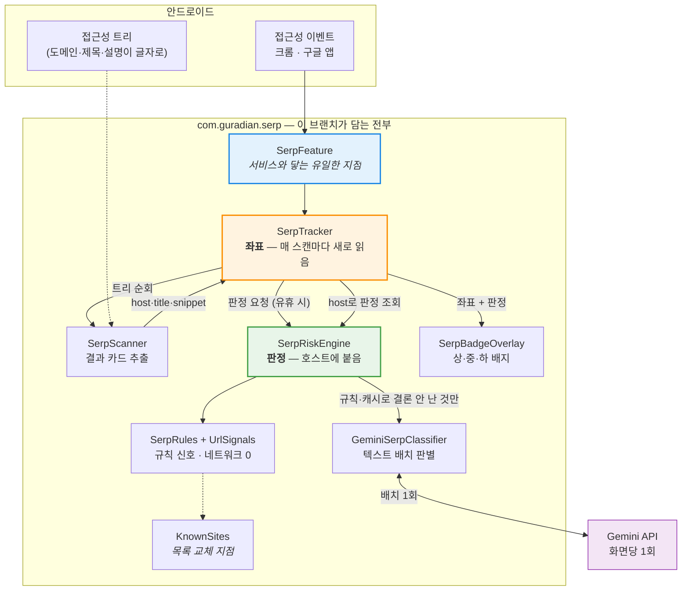
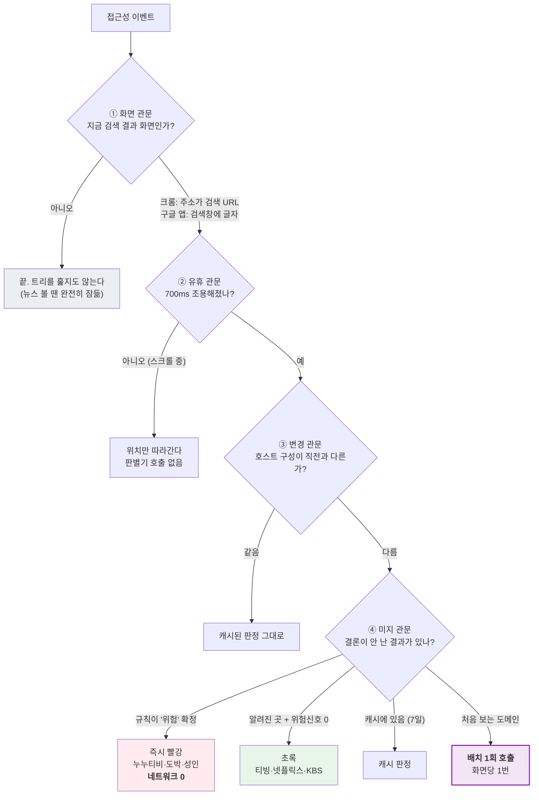
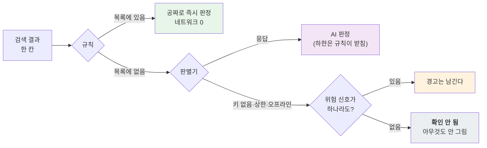
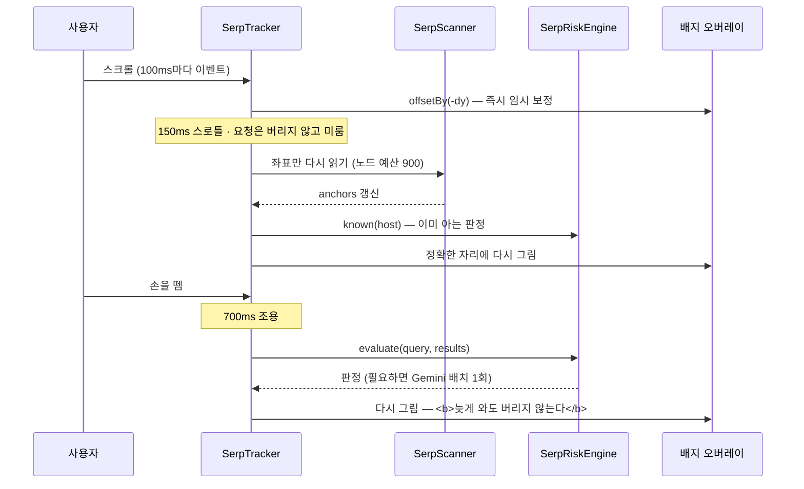

# 검색창 사이트 위험도 분석 (Search Site Risk AI)

> **이 브랜치는 `feat/search-site-analysis-ai`다.**
> 역할 분담 중 **"구글·크롬 검색 결과에서 사이트마다 위험도 상·중·하를 붙이는 기능"** 하나만 담는다.
> 광고 감지·광고 닫기·전환 탈출은 다른 팀원의 브랜치에서 따로 온다.

---

## 1. 무엇을 푸는가

어르신이 **"드라마 다시보기"** 를 검색하면 이런 화면이 나온다.

```
티비핫        https://tvhot2.com        ← 불법 다시보기
누누티비      https://nooo16.tv         ← 불법 다시보기
KBS 다시보기  https://vod.kbs.co.kr     ← 공식 서비스
주소월드      http://homepy.korean.net  ← 불법 사이트 링크 모음
```

**전부 똑같이 생겼다.** 광고가 아니므로 광고 감지는 아무것도 표시하지 않고, 어르신 입장에서는
맨 위에 있는 것을 누른다. 실제로 이 검색어의 1·2위가 불법 사이트다(2026-08-14 실측).

이 기능은 결과 하나하나에 **상(위험) · 중(주의) · 하(안전)** 를 붙인다.
누르기 **전에** 보여야 의미가 있으므로 자동으로 돈다.

---

## 2. 핵심 결정: 그림이 아니라 글자를 본다

원래 구현(senioradguard V3)은 검색 결과도 **스크린샷을 찍어 비전 모델**에 보냈다.
광고 배너와 같은 경로를 썼기 때문이다.

배너에는 그럴 이유가 있다 — 그림 한 장이라 무엇을 파는지 알려면 픽셀을 봐야 한다.
**검색 결과는 다르다. 도메인·제목·설명이 전부 접근성 트리에 글자로 들어 있다.**

| 비전 경로에서 필요했던 것 | 이 구현 |
|---|---|
| 스크린샷 권한 · 호출 간격 제한 | 없음 |
| 비트맵 복사 → 크롭 → 그레이스케일 → JPEG 인코딩 | 없음 |
| dHash 지문 · 이웃 지문 비교 | 호스트 문자열이 곧 캐시 키 |
| 이미지 토큰(장당 수백~수천) | 텍스트 1.2k 토큰 / 화면 |
| "화면 그림이 통째로 나간다"는 프라이버시 부담 | 검색 결과에 **이미 공개된** 제목·도메인만 |

---

## 3. 아키텍처



### 설계의 심장 — 판정과 좌표를 분리한다

처음 구현은 `evaluate()`가 **"이 사각형에 이 판정"** 을 함께 돌려줬다. 판정과 좌표가 한 덩어리라
**화면이 움직이면 판정까지 같이 못 쓰게 됐고**, 실기기에서 두 가지로 터졌다.

- 스크롤하면 배지가 통째로 사라짐 (좌표가 낡았다는 이유로 판정까지 버림)
- 판별기 응답이 **100% 버려짐** (돌아왔을 때 좌표가 이미 달라져 있음)

그래서 둘을 갈랐다.

| | 무엇에 붙는가 | 누가 들고 있는가 | 언제 갱신되는가 |
|---|---|---|---|
| **판정** | 호스트 (`tvhot2.com → 위험`) | `SerpRiskEngine` | 유휴 700ms 뒤 1회 |
| **좌표** | 화면 (`Rect`) | `SerpTracker` | 이벤트마다 (150ms 스로틀) |

그리기는 항상 `anchors`(좌표)를 돌며 `engine.known(host)`(판정)를 조회한다.
이렇게 하면 두 결함이 **고쳐지는 게 아니라 존재할 수 없게 된다** —
스크롤하면 좌표만 새로 읽어 다시 그리고, 응답이 5초 뒤에 와도 호스트에 얹으면 그 시점 좌표에
저절로 붙는다. 화면 세대(generation) 비교 코드는 통째로 삭제됐다.

---

## 4. AI가 분석하는 트리거 — 네 개의 관문

판별기(Gemini)는 아래를 **모두** 통과했을 때만 호출된다.



**호출은 항목당이 아니라 화면당 1회다.** 남은 항목이 2개든 8개든 한 배치로 묶어 보낸다.
결과당 부르면 검색 한 번에 8건이 나가고, 배치로 묶으면 모델이 결과들을 **서로 비교해서**
볼 수 있다 — "이 목록에서 tving.com이 정상이고 tvhot2.com이 그 흉내"라는 판단은
따로 볼 때보다 함께 볼 때 잘 나온다.

추가 안전장치: 화면당 최대 8건, 시간당 30회 토큰버킷, 429 응답 시 5분 쿨다운.

### 왜 버튼을 누를 때가 아닌가

광고 판별은 `[광고 찾기]`를 눌러야 돈다. 검색 결과는 그럴 수 없다 — 위험도는 **누르기 전에**
보여야 하고, 검색할 때마다 버튼을 한 번 더 누르게 하면 어르신은 그냥 안 누른다.
대신 나가는 정보를 줄였다: 화면 그림도 페이지 본문도 아닌, **검색 결과에 이미 공개돼 있는
제목·설명·도메인**만 나간다.

---

## 5. 위험도 상·중·하를 만드는 법

```
점수 = 가장 강한 신호 + (나머지 신호 합 ÷ 3) + 신뢰 가산(음수)
등급 = 확인 안 됨(표시 없음) / 0~39 하(초록) / 40~69 중(주황) / 70~100 상(빨강)
```

신호를 전부 더하지 않는다. 더하면 사소한 신호 다섯 개가 확정 신호 하나를 이겨버리고,
규칙을 하나 추가할 때마다 기존 판정이 통째로 흔들린다.

**확정 신호(hard)는 하한이 된다.** 판별기가 "안전하다"고 답해도 그 아래로는 안 내려간다.
신뢰 가산은 하한에 반영하지 않는다 — 네이버 카페라는 사실이 그 글이 도박을 권한다는 사실을
지워주지 않기 때문이다.

### 네 번째 등급 — '확인 안 됨'

**"걸린 규칙이 없다"는 '안전'이 아니다.** 우리 목록은 작고 앞으로도 완결되지 않는다
(불법 사이트는 차단되면 숫자만 바꿔 되살아난다: `tvhot2` → `tvhot3`, `noonoo` → `nooo16`).
그 상태에서 0점을 초록으로 옮기면 **모르는 사이트 전부에 안전 도장을 찍게 된다.**

그래서 초록은 근거가 있을 때만 붙는다 — 알려진 곳 목록에 있거나, 판별기가 실제로 보고
안전하다고 했을 때. 그 외에는 아무것도 그리지 않는다.
다만 침묵과 무시는 다르다. 위험 신호가 잡혔으면 판별기가 없어도 경고는 남는다.

### 규칙이 단독으로 끝내는 경계를 70에 둔 이유

표본 27건으로 두 경계를 다 돌려봤다.

| 규칙 확정 경계 | 규칙이 끝내는 비율 | 규칙의 오답 |
|---|---|---|
| 40 ('주의' 이상) | 25/27 | **2건** — APK 배포·IP 직결 사이트를 '중'으로 확정 (판별기는 90점대 '상') |
| **70 ('위험' 이상)** | 20/27 | **0건** |

규칙이 확정하면 판별기는 그 항목을 보지 못하므로 **틀려도 고칠 기회가 없다.**
'주의'는 정의상 확신이 없다는 뜻이고, 확신이 없으면 넘기는 것이 문지기의 계약이다.
비용은 거의 그대로다 — 호출이 화면당 1회라 판별기로 내려가는 항목이 2개든 12개든 같다.

---

## 6. 목록이 작아도 무너지지 않는 구조

규칙 목록(`KnownSites`)은 완결될 수 없다. 그래서 **목록에 기대지 않도록** 설계했다.



- 목록이 커질수록 **호출이 줄어들 뿐**, 목록이 작다고 기능이 망가지지 않는다
- 목록은 `KnownSites` 인터페이스 뒤에 있다. 방송통신심의위원회·KISA 피드가 생기면
  **구현 하나만 갈아끼우면 된다** — 판정 코드는 손대지 않는다
- `BuiltInKnownSites + FeedSites` 처럼 더하면 씨앗을 지우지 않고 얹힌다.
  피드를 못 받아도 최소한 씨앗만큼은 계속 동작한다

실기기에서 이 구조가 실제로 값을 했다. 우리 목록에 있던 `tvhot2.com` 옆에,
목록에 **없던** `nooo16.tv`·`m.dcinside.com`(누누티비 접속 주소 공유 글)·
`dunakavicsv8.hu`(제목은 뉴스처럼 보이는 헝가리 랜덤 도메인)가 나란히 떴고,
**뒤의 셋은 전부 AI가 잡았다.**

---

## 7. 스크롤을 어떻게 따라가는가



곁들인 장치 셋(전부 팀의 `BorderTracker`가 광고 테두리에서 쓰던 것과 같다):

- **요청을 버리지 않는다** — 스로틀·스캔 중에 온 요청은 트레일링으로 미룬다.
  버리면 드래그의 마지막 위치를 잃어 손 뗀 자리에서 배지가 어긋난 채 멈춘다
- **되밀기 보정** — 스캔이 도는 동안 더 구른 만큼(`scrollSinceScanStart`) 결과를 되민다.
  안 하면 배지가 뒤로 튄다
- **빈 화면 히스테리시스** — 결과를 못 찾은 스캔이 3번 연속돼야 지운다.
  한 번에 지우면 지연 로딩·예산 절단마다 배지가 깜빡이고, 정작 위험한 결과 위에서 경고가 사라진다

### 화면을 벗어날 때

검색 화면을 떠나 가는 곳(런처·잠금화면·다른 앱)은 우리 `packageNames`에 없다.
**"이제 지워라"고 알려줄 이벤트가 아예 오지 않는다** — 실기기에서 잠금화면 위에 빨간 테두리가
그대로 남았다. 이벤트에만 기대는 구조의 구멍이라 두 가지로 메웠다.

- **재확인 타이머(1초)** — 배지가 떠 있는 동안만 스스로 화면을 확인하고, 검색 결과가 아니면 지운다
- **`ACTION_SCREEN_OFF` 브로드캐스트** — 화면이 꺼지는 순간은 확실한 신호라 기다리지 않고 즉시 지운다

---

## 8. 크롬과 구글 앱, 둘 다 본다

어르신이 구글 검색을 쓰는 경로는 크롬만이 아니다. 홈 위젯·구글 앱이 오히려 흔하다.

| | 화면 판정 근거 | 검색어 |
|---|---|---|
| **크롬** | 주소창이 `google.com/search`·`search.naver.com`·`search.daum.net`… | 주소의 `q=` |
| **구글 앱** | 주소창이 **없다.** `googleapp_srp_search_box_text`에 글자가 있는지 | 그 노드의 텍스트 |

구글 앱에서 이 값이 중요한 이유가 둘이다.

1. 검색 완료 화면에는 **편집 가능한 노드가 하나도 없다.** 입력창(EditText)을 찾으면
   검색어를 영영 못 읽는다 — 실기기 트리 덤프로 확인했다
2. id의 `srp`는 search results page다. **이 노드의 존재 자체가 검색 결과 화면이라는 뜻**이라,
   검색어를 읽는 일과 화면을 판정하는 일이 한 번에 끝난다.
   패키지명만으로 통과시키면 홈 피드(큰 카드가 잔뜩 있고 검색창은 비어 있다)까지 계속 훑게 된다

---

## 9. 다른 task와의 독립성 — 병합을 위한 설계

안드로이드 접근성 서비스는 앱에 **하나뿐**이라, 모든 task가 같은 파일 한 곳으로 이벤트를 받는다.
각 task가 그 파일에 필드와 분기를 흩뿌리면 병합할 때마다 같은 자리에서 충돌한다.

그래서 이 기능이 서비스에 요구하는 것을 **여섯 줄로 줄였다.**

```kotlin
// 1) 필드 하나
private val serp by lazy { SerpFeature(this, scope, BuildConfig.GEMINI_API_KEY) }

// 2) 이벤트 필터에 우리 앱을 더한다 (구글 앱이 targetApps에 없기 때문)
packageNames = (targetApps + storePackages + SerpFeature.PACKAGES).toTypedArray()

// 3) dispatch에서 한 줄 — targetApps 필터보다 앞에
serp.onEvent(event, pkg)

// 4) 정리 — onInterrupt()와 onDestroy()에 각각
serp.stop()
```

**`com.guradian.serp` 패키지는 자기 밖의 어떤 클래스도 import하지 않는다**
(안드로이드 SDK와 코루틴 제외). 패키지를 통째로 복사해 다른 저장소·다른 패키지명으로 옮겨도
그대로 컴파일된다.

| 공유하지 않는 것 | 왜 |
|---|---|
| 오버레이 창 | 배지는 **자기 창**에 그린다. 광고 테두리와 서로를 지우지 않는다 (실기기에서 공존 확인) |
| 룰 엔진 · 판정 캐시 | 캐시 단위가 다르다 — 광고는 카드 문구, 위험도는 호스트 |
| `RateLimiter` | 같은 일을 하지만 `SerpCallBudget`으로 따로 뒀다. 30줄 중복으로 "이 패키지는 자기 밖의 무엇도 필요로 하지 않는다"를 산다 |
| 로그 태그 | 값은 같게(`GurADian`) 두어 한 줄로 다 보이되, 상수는 패키지 안에서 정의한다 |

---

## 10. 검증

### 실제 Gemini API 표본 (2026-08-14, gemini-3.1-flash-lite)

| 표본 | 건수 | 결과 |
|---|---|---|
| 정상 OTT·방송·포털 + 불법 다시보기 | 12 | 12/12 |
| 덜 알려진 정상 서비스 · 사칭 · 도박 · 성인 · APK · IP직결 · 단축주소 | 15 | 14/15 · **오탐 0 · 미탐 0** |
| 실제 운영 형태(규칙 신호 동봉, 판별기가 실제로 보는 것만) | 10 | 9/10 · **오탐 0 · 미탐 0** |

비용: 화면당 배치 1회 · 입력 1.2~1.4k 토큰 · 응답 5~9초.

### 실기기 (SM-S937N, 크롬 + 구글 앱)

```
serp 검색어='드라마 다시보기' 결과=3 판별=1 생략=false {상=2, 하=1}   ← 3건 중 AI 1회
serp 검색어='드라마 다시보기' 결과=5 판별=2 생략=false {하=3, 상=2}   ← 스크롤 후
serp 검색어='드라마 다시보기' 결과=3 판별=0 생략=false {상=2, 하=1}   ← 재방문: 캐시, AI 0회
serp 검색어='nunutv'        결과=3 판별=3 생략=false {상=3}          ← 구글 앱
```

확인된 것: 결과 추출 · 규칙/AI 분담 · 배지 렌더링 · **스크롤 추종** · 검색 화면 이탈 시 제거 ·
**잠금화면에 남지 않음** · 캐시 적중 · 광고 감지 오버레이와 공존.

### 단위 테스트

```bash
./gradlew :app:testDebugUnitTest      # 163개 통과
```

판정 전체가 안드로이드 타입을 쓰지 않아 JVM에서 그대로 돈다
(`SerpResult`에 좌표를 넣지 않은 이유 — 좌표는 `SerpScanner.Hit`가 따로 든다).

- `SerpRiskEngineTest` — **AI 호출 트리거의 명세.** 통과하는 동안 "언제 판별기가 불리는가"는 안 바뀐다
- `SerpSampleTest` — 27개 표본에 규칙만 돌려 "규칙이 확정한 것 중 오답 0"을 못 박는다
- `UnknownAndSitesTest` — "모르는 것을 안전이라 하지 않는다" + 목록 교체 가능성
- `UrlSignalsTest` · `RiskAggregatorTest` · `SerpScannerTest` · `GeminiSerpClassifierTest`

---

## 11. 파일

```
app/src/main/java/com/guradian/serp/
  SerpFeature.kt          ★ 서비스와 닿는 유일한 지점 (6줄 계약)
  SerpTracker.kt          ★ 스크롤 추종 — 좌표를 매번 새로 읽어 판정을 얹는다
  SerpRiskEngine.kt       ★ 호스트별 판정 저장소 · 트리거 · 캐시 · 상한
  SerpRules.kt            ★ AI를 부를지 정하는 문지기
  SerpScanner.kt          접근성 노드 → 결과 카드 (스크린샷 없음)
  KnownSites.kt           사이트 이름 목록 — 원격 피드 교체 지점
  UrlSignals.kt           세 축(도메인 신뢰도·저작권·피싱) 규칙 신호
  RiskAggregator.kt       점수 합성 · 확정 신호 하한 · '확인 안 됨' 판단
  SerpRisk.kt             등급(확인안됨·하·중·상) · 분류 · 판정
  SerpResult.kt           결과 한 칸(좌표 없음) · 호스트 분해
  SerpClassifier.kt       판별기 인터페이스(배치) + 규칙 전용 대역
  GeminiSerpClassifier.kt 텍스트 배치 판별 — 화면당 1회
  SerpBadgeOverlay.kt     배지 (별도 창 · FLAG_NOT_TOUCHABLE)
  SerpInternals.kt        로그 태그 · 호출 상한 (외부 의존을 끊기 위한 것)

docs/검색결과-위험도-설계.md   설계 근거와 검증 기록 전문
```

---

## 12. 배포 전에 반드시 할 것

- `GeminiSerpClassifier`는 앱에서 Gemini를 직접 부른다. **APK를 뜯으면 키가 그대로 나온다.**
  `SerpClassifier` 인터페이스가 교체점이고, 서버 경유 구현으로 갈아끼우면
  파이프라인·캐시·배지는 손대지 않는다
- 삼성 기기는 **Freecess가 프로세스를 얼린다**(`FZ: reason: Bg`). 배터리 최적화 예외를
  잡지 않으면 코드와 무관하게 조용히 멈춘다 — 실기기 검증 중 실제로 겪었다
- 네이버 앱·다음 앱은 미지원. 각 앱마다 "검색 결과 화면"을 알아보는 근거를 따로 찾아야 한다
