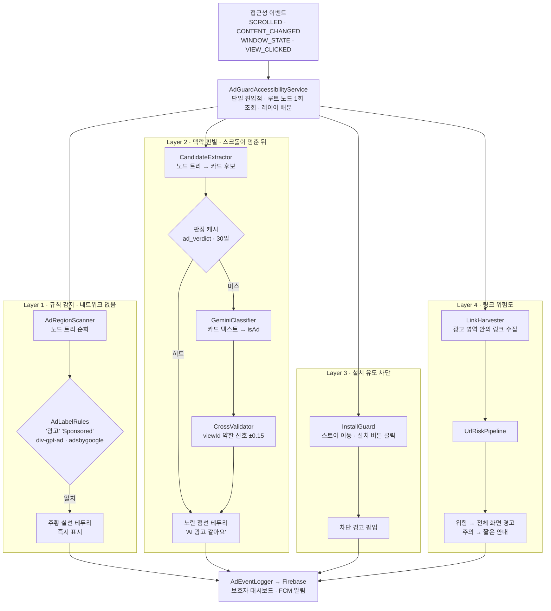
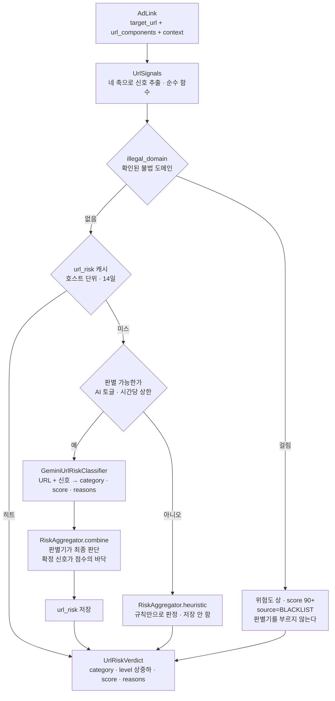
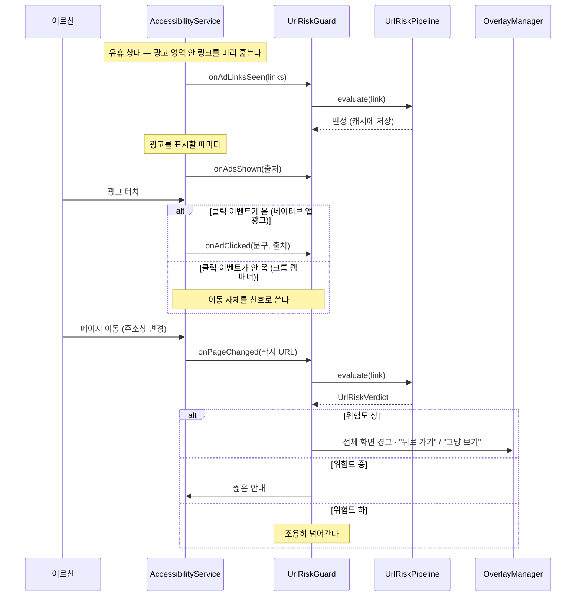

# SeniorAdGuard

어르신 스마트폰의 광고를 자동으로 감지하고, **그 광고가 데려가는 곳이 위험한지까지** 판별하는 안드로이드 앱입니다.

---

## 어떻게 동작하나요?

화면에 광고가 나타나면 4단계로 처리합니다.

| 단계 | 방법 | 결과 |
|------|------|------|
| 1단계 | 광고 키워드/패턴 즉시 감지 | 주황 실선 테두리 |
| 2단계 | AI(Gemini)가 애매한 광고를 맥락으로 판별 | 노란 점선 + "AI 광고 같아요" |
| 3단계 | 의심스러운 앱 설치 차단 | 설치 전 경고 |
| **4단계** | **광고가 연결하는 URL의 위험도 판별** | **위험도 상 → 전체 화면 경고 / 중 → 짧은 안내** |

1·2단계가 "이게 광고인가"를 보고, 4단계는 "그 광고가 데려가는 곳이 위험한가"를 봅니다.
어르신에게 실제로 피해를 입히는 것은 광고 그 자체가 아니라 광고가 데려가는 곳이라,
광고를 정확히 찾는 것만으로는 절반밖에 지키지 못합니다.

두 가지 모드가 있습니다.
- **어르신 모드**: 광고를 조용히 자동 차단, 위험 링크는 경고
- **보호자 모드**: 어르신 기기에서 감지된 광고·위험 링크 알림 수신 + 대시보드 확인

---

## 전체 아키텍처



Layer 1·2가 표시한 영역이 Layer 4의 **입력 범위**가 됩니다.
화면의 모든 링크를 판별하면 비용도 오탐도 감당이 되지 않기 때문에,
광고로 표시된 영역 안의 링크만 봅니다.

---

## Layer 4 — 광고 링크 위험도 판별

### 판정 순서

앞 단계일수록 쌉니다. 실제로 대부분의 링크가 판별기에 닿기 전에 결론이 납니다.



### 클릭에서 판정까지

접근성 이벤트에는 "이 클릭이 저 이동을 일으켰다"는 연결이 없습니다.
게다가 **크롬은 웹 페이지 안의 배너를 눌러도 `TYPE_VIEW_CLICKED`를 보내주지 않습니다**
(실기기 확인 — 아래 [실기기 검증](#실기기-검증) 참고).
그래서 신호를 두 개 씁니다.

| 신호 | 조건 | `is_ad_element` |
|------|------|----------------|
| 클릭 기억 | 광고 영역 안이 눌리고 **8초 안에** 주소가 바뀜 | `true` |
| 이동 자체 | **광고가 떠 있던 화면**에서 **다른 등록 도메인**으로 넘어감 | `false` |

두 번째 신호는 정상 외부 링크에도 걸립니다. 그래도 그때 판정은 '낮음'으로 나와 경고가 뜨지 않으므로,
틀렸을 때의 대가가 **판별 호출 한 번**에 그칩니다. 이 대가를 감수하는 대신 모바일 웹 광고를 놓치지 않습니다.



### 입력 스키마

`UrlParser.parse`가 URL 문자열 하나를 이 형태로 분해합니다.

```json
{
  "target_url": "https://ad.yna.co.kr/RealMedia/ads/click_lx.ads/12345",
  "url_components": {
    "protocol": "https",
    "domain": "ad.yna.co.kr",
    "root_domain": "yna.co.kr",
    "tld": "co.kr",
    "subdomain": "ad",
    "path": "/RealMedia/ads/click_lx.ads/12345"
  },
  "context": {
    "source_page_url": "https://www.yna.co.kr",
    "anchor_text": "삼성전자 신형 스마트폰 특가",
    "is_ad_element": true,
    "is_shortener": false
  }
}
```

- `path`에는 **쿼리와 프래그먼트가 포함**됩니다. 추적 파라미터와 유인 문구가 거기 들어 있어 잘라내면 판단 근거가 사라집니다.
- `root_domain`은 두 라벨짜리 공개 접미사(`co.kr`, `co.jp`, `com.au` …)를 알아봅니다. 이게 없으면 모든 한국 사이트의 등록 도메인이 `co.kr`로 뭉개집니다.

### 네 방향으로 본다

한 링크를 서로 다른 눈으로 각각 훑습니다. 한 축이 강하게 반응하면 다른 축이 조용해도 위험할 수 있습니다.

| 축 | 무엇을 보는가 | 예시 신호 |
|----|--------------|----------|
| **도메인 신뢰도** | 알려진 사업자인가, 무료·익명 등록이 쉬운 TLD인가 | `.xyz` `.top` · IP 주소 직접 연결 · 퓨니코드 · 기계가 만든 듯한 긴 이름 |
| **저작권·불법성** | 불법 다시보기·웹툰·토렌트·사설 도박인가 | `nunu` `toki` `torrent` · 도메인 라벨의 `bet` `toto` `casino` · "다시보기" "무료보기" |
| **피싱·속임수** | 사칭·은폐·재촉이 있는가 | 브랜드명이 서브도메인에만 · 단축 주소 · `@` 속임수 · `.apk` 직접 배포 · "본인인증" "당첨" |
| **광고 트래킹** | 공식 광고 서버인가 | `doubleclick.net` · `ad.` 서브도메인 · `/RealMedia/ads/` `/pagead/` `utm_source=` |

### 점수를 만드는 방법

신호를 전부 더하지 않습니다. 더하면 사소한 신호 다섯 개가 확정 신호 하나를 이겨버리고,
축을 늘릴 때마다 기존 판정이 통째로 흔들립니다.

```
점수 = 가장 강한 신호 + (나머지 신호 합 ÷ 3) + 신뢰 가산(음수)
```

| 규칙 | 이유 |
|------|------|
| 광고 축 신호만 있으면 **25점 상한** | 언론사 공식 광고 서버에까지 경고가 뜨면 사용자가 경고 자체를 무시한다 |
| 확정 신호(`hard`)는 **점수의 바닥** | `.apk` 직접 배포나 `@` 속임수처럼 URL에 드러난 사실은 판별기가 넘겨도 남아야 한다 |
| 바닥 계산에 신뢰 가산은 반영하지 않음 | 알려진 브랜드라는 사실이 확정 신호를 지워주지는 않는다 |
| 판별기가 **최종 판단** | 목록에 없는 새 사이트를 잡으려고 판별기를 붙였다. 규칙이 조용하다고 판별기를 깎으면 안 된다 |

**등급**: `0–39 하(낮음)` · `40–69 중(주의)` · `70–100 상(위험)`

### 판정 예시

| 링크 | 성격 | 등급 | 근거 |
|------|------|------|------|
| `tvhot2.com/player/1` | ILLEGAL_STREAMING_OR_COPYRIGHT | **상** | 목록에 등록된 불법 다시보기 사이트 (목록에 없어도 이름만으로 상) |
| `naver.login-secure.xyz/verify` | PHISHING_OR_SCAM | **상** | 'naver' 이름을 흉내 냈지만 실제 주소는 `login-secure.xyz` · 악용 비중 높은 TLD |
| `cdn-free-app.top/gift.apk` | MALWARE_OR_UNWANTED_APP | **상** | 설치 파일을 직접 내려받게 함 |
| `4shared.com/file/1` | UNVERIFIED_THIRD_PARTY | **중** | 정상 클라우드지만 저작권 침해 파일 비중이 높고 감염 위험 상존 |
| `ad.yna.co.kr/RealMedia/ads/…` | OFFICIAL_AD_TRACKER | **하** | 알려진 사업자 도메인 · 광고 축 신호만 존재 |

### 왜 URL에 접속해 보지 않는가

링크를 열어 내용을 보면 판정이 훨씬 정확해집니다. 그럼에도 열지 않습니다.

- 접속을 막아 둔 도메인이 있어 절반은 어차피 못 봅니다
- 어르신 회선으로 낯선 서버에 요청을 보내는 것 자체가 위험을 만듭니다 (추적 픽셀, 리다이렉트 체인, 데이터 요금)
- 광고 클릭 URL은 한 번 열면 광고비가 집행됩니다 — 우리가 광고주에게 비용을 씌우는 셈입니다

판단 근거를 URL 문자열과 출처 문맥으로 한정하는 것은 타협이 아니라 이 기능의 전제입니다.

### 링크 주소는 어떻게 얻는가

`AccessibilityNodeInfo`에는 `href`에 해당하는 표준 필드가 없습니다. 세 경로를 순서대로 시도합니다.

1. **크롬 extras** (`AccessibilityNodeInfo.targetUrl`) — 있으면 가장 정확하고 **누르기 전에** 알 수 있는 유일한 경로
2. **화면에 드러난 주소** — 광고 카드가 문구나 contentDescription에 도메인을 그대로 노출하는 경우
3. **누른 뒤 주소창** — 위 둘이 비면 착지 주소를 읽습니다. 사후 확인이라 이동을 막지는 못하지만 **반드시 동작하는 경로**이고, "뒤로 가기"를 권하기에는 늦지 않습니다

네이티브 앱(유튜브·인스타)은 1·2가 거의 통하지 않습니다. 앱 안 광고는 눌렀을 때 크롬이나 커스텀탭이 뜨므로 3번으로 잡힙니다.

> ⚠️ 크롬은 **이미지 노드에도** `targetUrl`을 채워 줍니다. 거르지 않으면 `img2·img4·img5…` 같은
> 이미지 CDN 호스트마다 판별기 호출이 한 건씩 나갑니다 — 실측에서 한 페이지에 6건이 그렇게
> 낭비됐습니다. `LinkHarvester.isStaticAsset`이 이미지·스크립트·미디어 주소를 끊습니다.

---

## 실기기 검증

Galaxy S25 Edge(SM-S937N, Android 16)에서 실제 Gemini 키로 확인했습니다.

| 확인한 것 | 결과 |
|-----------|------|
| Room v3 스키마 · `IN` 접미사 조회 · 씨앗 적재 · 캐시 왕복 | 계측 테스트 17건 통과 |
| 정상 광고 서버 판정 (연합뉴스) | `ad.yna.co.kr LOW(10) OFFICIAL_AD_TRACKER` |
| 광고 클릭 → 착지 판별 (한국경제) | `ad.doubleclick.net LOW(10)` → `exordium-sangdo.com LOW(30) UNVERIFIED_THIRD_PARTY` |
| 위험도 상 → 전체 화면 경고 | `naver.secure-login.invalid HIGH(95) PHISHING_OR_SCAM` + 경고창 표시 |

실기기에서만 드러난 것 세 가지가 코드에 반영돼 있습니다.

1. **크롬은 웹 배너 터치에 `TYPE_VIEW_CLICKED`를 보내지 않는다.** 실제로 광고를 눌러 광고주
   페이지로 넘어갔는데 클릭 이벤트가 하나도 도착하지 않았습니다. 클릭 이벤트에만 기대는
   설계였다면 모바일 웹 광고를 전부 놓쳤을 것입니다 → 이동 자체를 두 번째 신호로 추가
2. **크롬은 이미지 노드에도 `targetUrl`을 준다** → 정적 자원 주소 필터 추가
3. **경고창 배경이 반투명(0xDD)이라 뒷 페이지 글자와 겹쳐 읽혔다** → 거의 불투명(0xF7)으로 조정.
   경고를 읽지 못하면 경고가 아닙니다

재현 방법:

```bash
./gradlew :app:installDebug
adb shell appops set com.senioradguard SYSTEM_ALERT_WINDOW allow
adb shell settings put secure enabled_accessibility_services \
  com.senioradguard/com.senioradguard.service.AdGuardAccessibilityService
adb shell settings put secure accessibility_enabled 1
adb logcat -s AdGuard:I
```

위험도 상 경로를 안전하게 시험하려면 **절대 연결되지 않는** `.invalid` 도메인을 씁니다
(실제 악성 사이트에 접속하지 않습니다).

```bash
adb shell am start -a android.intent.action.VIEW \
  -d "https://naver.secure-login.invalid/verify/gift.apk" com.android.chrome
```

### 개인정보

- 외부로 나가는 것은 **URL·링크 문구·출처 도메인**까지입니다. 화면 본문은 보내지 않습니다
- 보호자에게 남는 것은 **호스트와 등급까지**입니다. 전체 URL에는 어르신을 식별할 수 있는 추적 파라미터가 붙어 있고, 어느 기사에서 눌렀는지까지 넘길 이유가 없습니다
- LLM 호출은 AI 판별 토글(기본 OFF)에 묶여 있습니다. **토글을 꺼도** 불법 목록 조회와 규칙 판정은 네트워크 없이 그대로 동작합니다

---

## 시작하기 전에 필요한 것

### 1. Gemini API 키 발급
1. [Google AI Studio](https://aistudio.google.com) 접속
2. API 키 생성
3. `local.properties`에 추가:
   ```
   GEMINI_API_KEY=여기에_키_입력
   ```

키가 없어도 빌드·실행됩니다. Layer 2는 `StubClassifier`, Layer 4는 `HeuristicUrlRiskClassifier`로 물러나 전 구간이 그대로 돕니다 (판정 품질만 떨어집니다).

### 2. Firebase 연결
1. [Firebase Console](https://console.firebase.google.com)에서 프로젝트 생성
2. Android 앱 등록 (패키지명: `com.senioradguard`)
3. `google-services.json` 다운로드 → `app/` 폴더에 넣기
4. Realtime Database 생성 (테스트 모드로 시작)
5. Cloud Messaging 활성화

> Firebase 무료 플랜(Spark)으로 충분합니다.

---

## 현재 되는 것 ✅

- 광고 키워드 자동 감지 및 테두리 표시
- Gemini AI로 애매한 광고 판별
- 테두리가 스크롤을 따라옴 (스크롤 델타 즉시 이동 + 스캔 보정)
- 앱 설치 차단 경고
- **광고 링크 위험도 판별 (Layer 4) — 불법 도메인 목록 → 캐시 → LLM 추론**
- **위험도 상이면 전체 화면 경고 + "뒤로 가기"**
- 보호자 앱에 실시간 알림 전송 (FCM)
- 보호자 대시보드에서 차단 내역 확인
- 기기 2대로 크로스 네트워크 실시간 동기화 확인 완료

## 현재 안 되는 것 ❌

- **광고가 앱을 직접 여는 경우(딥링크)는 판별 대상이 아닙니다.** 실측에서 쿠팡 배너를 누르니
  URL 없이 쿠팡 앱이 바로 열렸습니다 — 판단할 URL 자체가 존재하지 않습니다.
  스토어로 가는 경우는 Layer 3(InstallGuard)가 잡습니다
- **누르기 전 경고는 크롬이 링크 주소를 노출할 때만** 가능합니다. 대부분은 누른 뒤 착지 주소로 판별합니다
- **불법 도메인 목록이 씨앗 수준**입니다. 실제 운영에는 관리되는 피드가 필요합니다 (`IllegalDomainRepository.replaceFromRemote`가 교체점)
- 단축 주소의 최종 목적지 추적 (접속하지 않는 원칙 때문에 단축 주소 자체를 신호로만 봅니다)
- 광고 네트워크 블랙리스트 자동 업데이트 (배터리 이슈로 비활성화)
- 앱 삭제 기능 / 화이트리스트 관리

---

## 앱 설치 후 필수 설정

앱을 설치하거나 재설치하면 **반드시** 아래 두 가지를 켜야 합니다.

1. **접근성 서비스 활성화** — 설정 → 접근성 → SeniorAdGuard → 켜기
2. **알림 권한 허용** — 처음 실행 시 팝업에서 허용

> 재설치하면 접근성 서비스가 자동으로 꺼집니다. 반드시 다시 켜세요.

---

## 절대 건드리면 안 되는 것 ⚠️

- `AdLabelRules.kt` — 광고 판별 규칙 파일. 잘못 수정하면 광고 감지가 통째로 망가집니다.
- `AdBorderOverlay`의 `FLAG_NOT_TOUCHABLE` — 광고 위를 덮는 테두리가 터치를 막으면 구글 정책 위반입니다.

---

## 테스트할 때 참고

- Gemini 키가 없으면 Layer 2는 "광고 아님", Layer 4는 규칙 판정으로 물러납니다
- Firebase 없으면 보호자 알림만 동작 안 하고 나머지는 정상
- 같은 광고 판정은 30일, 같은 호스트의 위험도 판정은 14일 캐싱
- Layer 4 동작 확인은 logcat에서 `layer4` 태그로 볼 수 있습니다
  ```
  adb logcat -s AdGuard:I AdGuardUrl:E
  # layer4 tvhot2.com HIGH(95) ILLEGAL_STREAMING_OR_COPYRIGHT 출처=BLACKLIST
  ```

```bash
./gradlew :app:testDebugUnitTest      # JVM 단위 테스트 (Layer 4 포함)
```

---

## 파일 구조

```
app/src/main/java/com/senioradguard/
├── service/AdGuardAccessibilityService.kt  ← 단일 진입점, 레이어 배분
│                                             ScrollStopPredictor · SightingLog 포함
├── region/                     Layer 1 (팀원 AdDetectService에서 이식)
│   ├── AdLabelRules.kt         광고 라벨/컨테이너 id 판정 (순수 함수)
│   └── AdRegionScanner.kt      노드 트리 순회 → 광고 영역
│
├── agent/                      Layer 2 파이프라인
│   ├── CandidateExtractor.kt   Agent1: 노드트리 → 카드 단위 후보
│   ├── AdClassifier.kt         Agent2 인터페이스 ← 서버 교체점
│   ├── GeminiClient.kt           Gemini 호출 한 겹 (Layer 2·4 공용, 429 휴식 공유)
│   ├── GeminiClassifier.kt       Gemini 구현 (기본)
│   ├── StubClassifier.kt         규칙 기반 폴백 (키 없을 때, LLM 아님)
│   ├── CrossValidator.kt       Agent4: viewId 약한 신호로 ±0.15
│   ├── AgentPipeline.kt        캐시 조회 → 판별 → 저장 → 표시
│   ├── CardText.kt             마스킹 · 정규화 · 캐시 키
│   └── RateLimiter.kt          시간당 호출 상한 (토큰버킷)
│
├── guard/                      Layer 3
│   ├── InstallGuard.kt         스토어 이동 · 설치 버튼 클릭 감지
│   └── InstallTriggerRules.kt  위험 문구 판정 (순수 함수)
│
├── url/                        Layer 4 — 링크 위험도  ★ 이번 브랜치
│   ├── AdLink.kt               입력 스키마 (target_url · components · context)
│   ├── UrlParser.kt            URL → 구성 요소 분해 · 공개 접미사 (순수 함수)
│   ├── UrlSignals.kt           네 축 신호 추출 (순수 함수)
│   ├── RiskLevel.kt            등급 상중하 · 성격 분류 · 판정 데이터
│   ├── RiskAggregator.kt       점수 계산 · 판별기 결과 합성 (순수 함수)
│   ├── UrlRiskClassifier.kt    Agent5 인터페이스 + 규칙 기반 폴백
│   ├── GeminiUrlRiskClassifier.kt  LLM 구현 (URL만 보고 추론)
│   ├── LinkHarvester.kt        접근성 노드 → 링크 주소 (extras · 텍스트 · 주소창)
│   ├── UrlRiskPipeline.kt      목록 → 캐시 → 판별 → 저장
│   └── UrlRiskGuard.kt         클릭·이동 연결 · 중복 경고 억제 (안드로이드 의존 없음)
│                               ※ 클릭 이벤트가 안 오는 크롬 웹 배너 대비 경로 포함
│
├── overlay/
│   ├── AdBorderOverlay.kt      테두리(비터치) + 닫기 막대(터치, 별개 창)
│   └── OverlayManager.kt       Layer 3·4 차단/위험 경고 팝업
│
├── remote/FirebaseRepo.kt      익명 인증 · 역할 · 연결 · 이벤트 기록/구독
├── logger/AdEventLogger.kt     감지 이벤트 → Firebase (layer 1~4)
│
├── detector/
│   ├── db/                     Room v3
│   │   ├── AdVerdict           Layer 2 광고 판정 캐시 (30일)
│   │   ├── IllegalDomain       Layer 4 확인된 불법 도메인  ★
│   │   ├── UrlRisk             Layer 4 위험도 캐시 (14일, 호스트 단위)  ★
│   │   └── BlacklistDomain     광고 네트워크 목록
│   ├── IllegalDomainRepository.kt  불법 목록 씨앗 · 원격 교체점  ★
│   ├── BlacklistRepository.kt  원격 목록 다운로드/파싱/교체
│   ├── DomainMatcher.kt        접미사 분해 O(1) 매칭
│   └── AdDetector.kt           ⚠️ dead code — 생성 지점 없음
│
├── ui/
│   ├── SetupActivity.kt        역할 선택 (어르신 / 보호자)
│   ├── GuardianActivity.kt     보호자 대시보드 + 연결 코드 입력
│   ├── ServiceStatus.kt        서비스가 실제로 살아있는지 확인
│   └── BatteryOptimizationGuide.kt
└── MainActivity.kt             어르신 화면 — 상태 · AI 토글 · 연결 코드
```

### Layer 2와 Layer 4를 왜 나눠 두었나

캐시 단위가 다르기 때문입니다.
광고 판정은 **카드 문구 단위**로, 위험도는 **호스트 단위**로 캐시해야 각각의 적중률이 나옵니다.
한 판별기로 합치면 둘 중 하나는 반드시 캐시가 맞지 않습니다.

교체점도 따로입니다 — `AdClassifier`와 `UrlRiskClassifier` 구현체만 바꾸면
파이프라인·캐시·오버레이는 손대지 않고 서버 경유 방식으로 옮길 수 있습니다.
